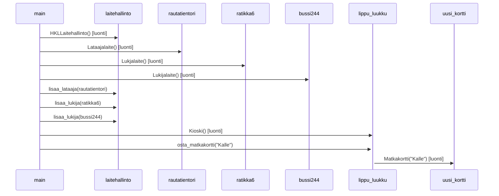

```mermaid
sequenceDiagram
    main->>laitehallinto: HKLLaitehallinto() [luonti]
    main->>rautatientori: Lataajalaite() [luonti]
    main->>ratikka6: Lukjalaite() [luonti]
    main->>bussi244: Lukijalaite() [luonti]

    main->>+laitehallinto: lisaa_lataaja(rautatientori)
    main->>+laitehallinto: lisaa_lukija(ratikka6)
    main->>+laitehallinto: lisaa_lukija(bussi244)

    main->>lippu_luukku: Kioski() [luonti]
    main->>+lippu_luukku: osta_matkakortti("Kalle")
    lippu_luukku->>uusi_kortti: Matkakortti("Kalle") [luonti]
    

```