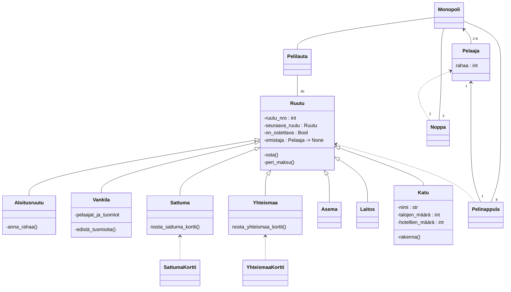

```mermaid

classDiagram

    class Monopoli

    class Pelilauta
    
    %% Luokka Ruutu on "abstract base class".
    %% Jos luokan Ruutu lapsella atribuutti on_ostettava == False, 
    %% metodit osta ja peri_maksu eivä toimi, eikä omistajaa siis voida asettaa.
    %% Asemat ja laitokset ovat ostettavia, eivätkä tarvitse lisätoimintoja.

    class Ruutu{
        -ruutu_nro : int
        -seuraava_ruutu : Ruutu
        -on_ostettava : Bool
        -omistaja : Pelaaja -> None
        -osta()
        -peri_maksu()
    }

    %% Luokan Ruutu lapset alkaa
    class Aloitusruutu{
        -anna_rahaa()
    }

    class Vankila{
        -pelaajat_ja_tuomiot
        -edistä_tuomioita()
    }

    class Sattuma{
        nosta_sattuma_kortti()
    }

    class Yhteismaa{
        nosta_yhteismaa_kortti()
    }

    class Asema

    class Laitos

    %% Metodi "rakenna" tarkistaa talojen määrän ja toimii sen mukaisesti
    class Katu{
        -nimi : str
        -talojen_määrä : int
        -hotellien_määrä : int
        -rakenna()
    }
    %% Luokan ruutu lapset loppuu

    class SattumaKortti

    class YhteismaaKortti

    class Pelinappula

    class Pelaaja{
        rahaa : int
    }

    class Noppa


    Monopoli <-- "2-8" Pelaaja

    Monopoli -- Pelilauta

    Monopoli -- "2" Noppa

    Monopoli -- "8" Pelinappula

    Pelilauta -- "40" Ruutu

    Pelaaja "1" <-- "1" Pelinappula

    Pelaaja <.. "2" Noppa

    Ruutu <.. Pelinappula

    Ruutu <|-- Aloitusruutu

    Ruutu <|-- Vankila

    Ruutu <|-- Sattuma

    Ruutu <|-- Yhteismaa

    Ruutu <|-- Asema

    Ruutu <|-- Laitos

    Ruutu <|-- Katu

    Yhteismaa <.. YhteismaaKortti

    Sattuma <.. SattumaKortti

    

```
