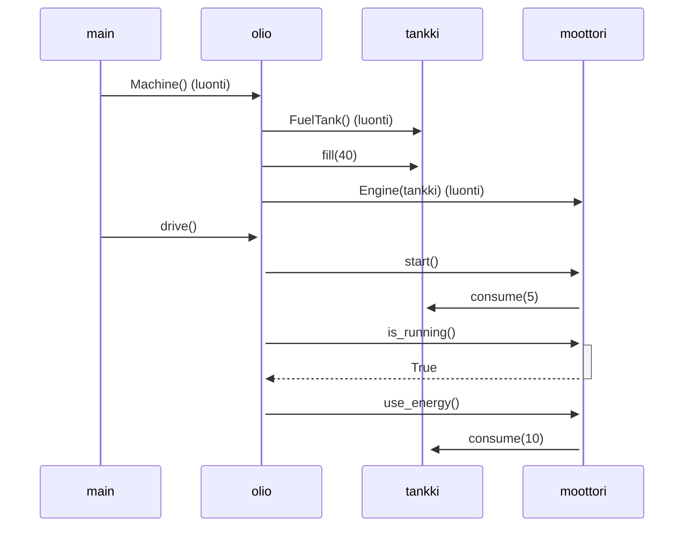

```mermaid

sequenceDiagram
    main->>olio: Machine() (luonti)

    olio->>tankki: FuelTank() (luonti)

    olio->>+tankki: fill(40)

    olio->>moottori: Engine(tankki) (luonti)


    main->>+olio: drive()
    
    olio->>+moottori: start()

    moottori->>+tankki: consume(5)

    olio->>+moottori: is_running()

    moottori-->>-olio: True

    olio->>+moottori: use_energy()

    moottori->>+tankki: consume(10)


```